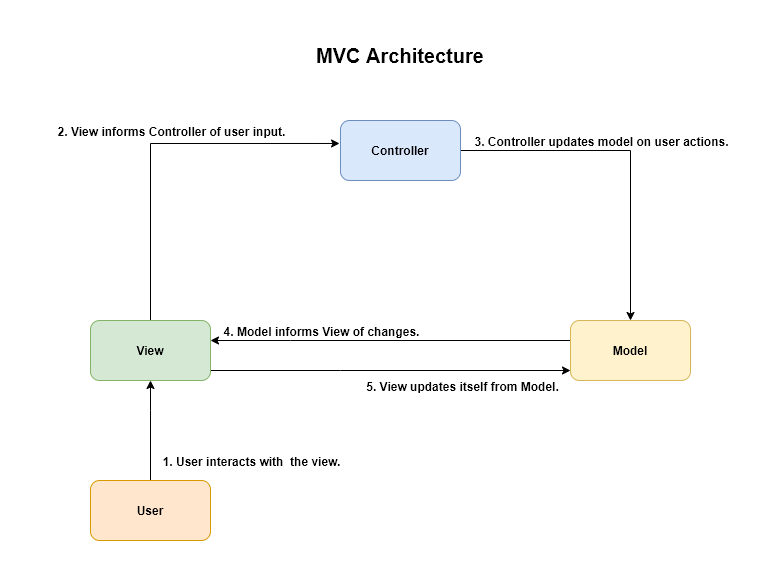
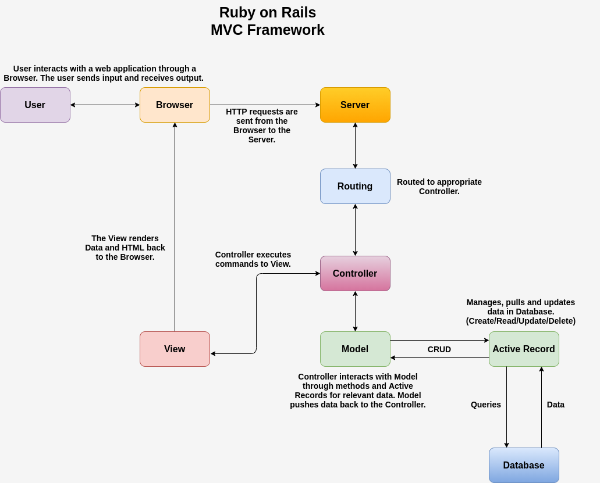
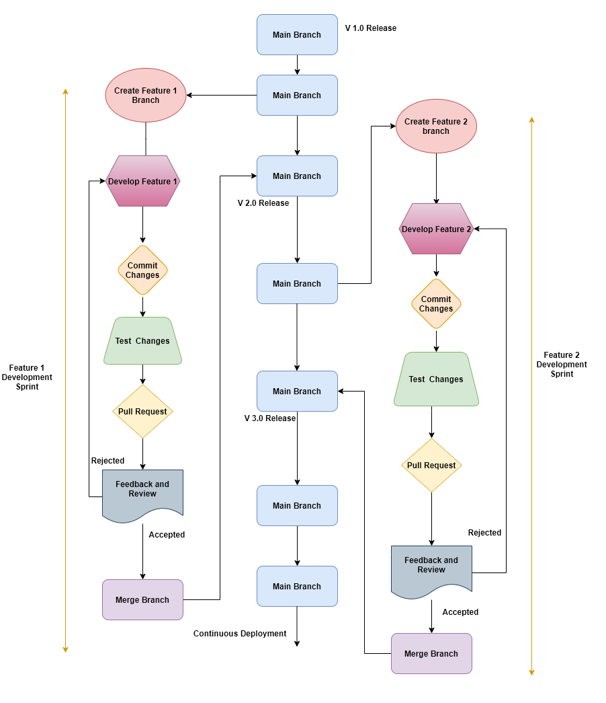
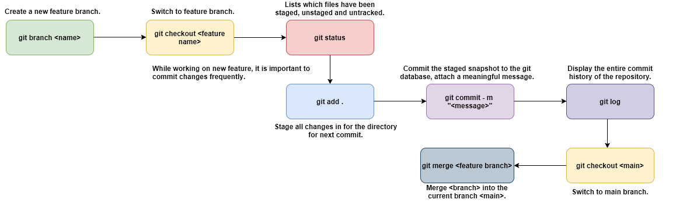
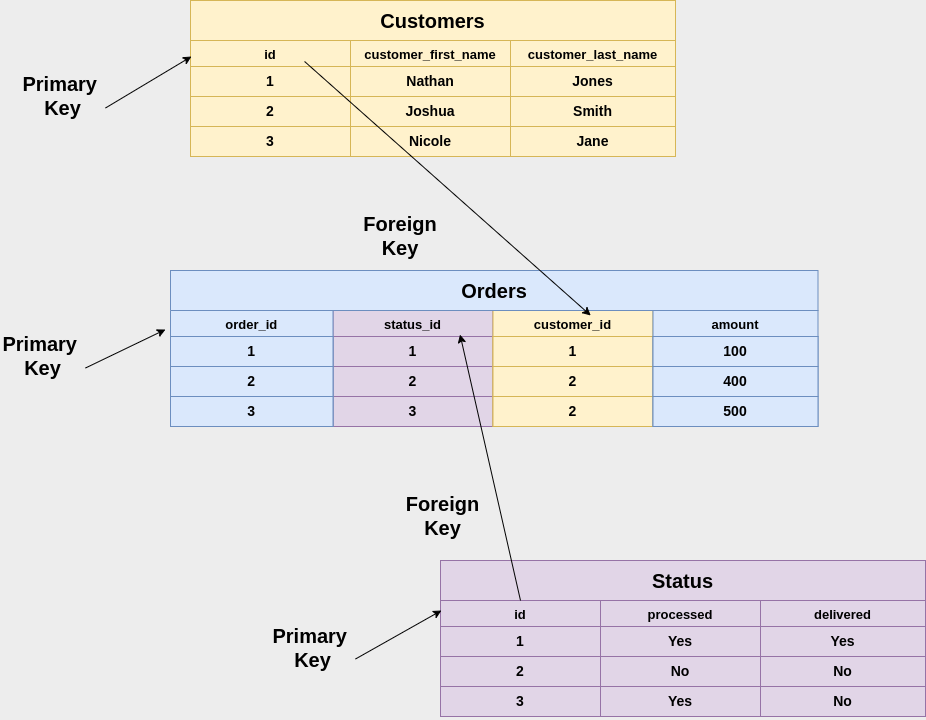
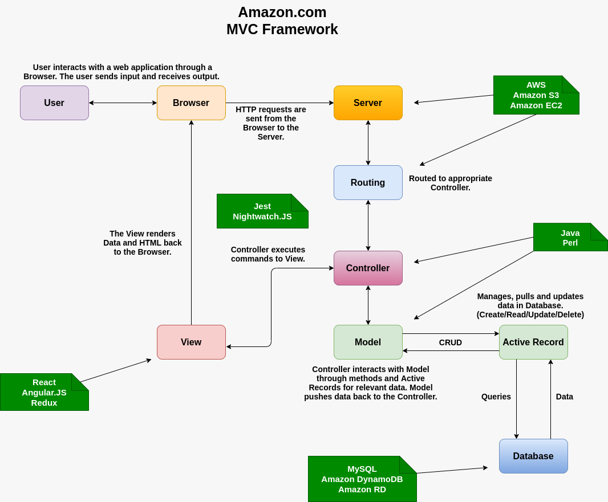
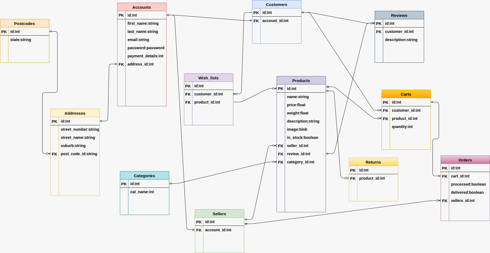

# Workbook - T2A1-A - Nathan Blaga

## **Question 1:**

A typical Rails application implements and follows a Model-View-Controller (MVC) framework. It divides the application into three main components; Model, View and Controller. Each component is designed and built to handle specific development aspects of the application (Guru99). This can be demonstrated through a customer based application.
The Model component represents the customer’s data being stored in the database, including their unique id, name, email, phone number and other relevant information. At the lowest level of the pattern, the model's primary function is to maintain data stored within the database (Guru99). The View component represents the front side of the framework. This involves displaying the information to the customer which is pulled directly from the database. This is achieved through different user interface (UI) conventions (Guru99). The Controller component represents the business logic behind the entire framework. It interprets and handles all customer interactions and requests by instructing the Views and Models on what commands to execute (Guru99). Below is the basic flow between a customer’s interactions with an application and the changing states of all three components.



Ruby on Rails utilises the same MVC framework in conjunction with various other features briefly explained in Adrian Mejia’s article; ‘Ruby on Rails Architectural Design’. Main Rails features include:

- Representational State Transfer (REST) for web services.
- Support for different major databases (MySQL, Oracle, MS SQL Server, PostgreSQL and more).
- Open-source sever side scripting language.
- Convention over configuration
- Scripts generators to automate tasks.
- Use of YAML machine.

The diagram below depicts how Ruby on Rails utilises MVC architecture to not only improve the maintainability of the application, but also improve the interaction and functionality of a web application on both consumer and developer levels.



Using the customer example from above, a user/customer accesses the web application through a browser. Their inputs sends HTTP requests to the server which is then routed to a controller. The requests are processed by the controller which then interacts with the model. The model is seen as a representation of the stored data of the customer in the database. Once the controller updates the model with the user’s requests, the controller passes the relevant data/information through the view to be rendered back to the browser and user. This is a very basic description of how Rails incorporates MVC into its applications however clearly defines the separation of logic and concerns between the different components. This has its benefits as described in the following quote; “The MVC allows a clean separation of business logic from the HTML, which improves decoupling and testing” (Mejia 2011).

## **Question 2:**

“Data Management Systems (DBMS) refer to the technology solution used to optimize and manage the storage and retrieval of data from databases” (Raza 2018).

“PostgreSQL is a powerful, open source object-relational database system that uses and extends the SQL language combined with many features that safely store and scale the most complicated data workloads”(PostgreSQL). PostgreSQL can add tremendous value to any project by providing a diverse array of predefined functions, JSON functionality and support, in addition to a scalable engine and framework (Arsenault 2017). Applications and developers can benefit form using PostgreSQL due to its extensive community support, user friendly functionality and its ability to take advantage of its user-defined data types and procedures (EDUCBA).

In comparison, PostgreSQL has received criticism for its lack of ability to hold up to other systems in terms of speed, memory utilisation, and general performance (Hristozov 2019). ‘The Pros and Cons of Popular Databases’ by Cody Arsenault outlines the weaknesses of PostgreSQL to be as follows; “Installation, configuration can be confusing and challenging alongside spotty documentation, it is not easy to obtain a clear understanding of what is going on under the hood.” Furthermore while PostgreSQL community continues to grow, its failure to jump ahead in popularity compared to MYSQL and various other systems creates an obstacle for it dominate as the go-to DBMS. (Hristozov 2019). A “lack” of skilled professionals under the PostgreSQL ‘banner’, pushing its reputation and abilities, holds it back from taking off (Hristozov 2019).

When deciding on a DBMS for any project, entities such as ACME Corporation must consider the advantages compared to its disadvantages. Ultimately, the most efficient and effective database management system will depend on a number of variables such as the size of the project and its goals and requirements (Hristozov 2019). More importantly developers should always consider the following; third party support, deployment such as Heroku acceptance of particular systems, framework requirements and team recommendations and capabilities.

## **Question 3:**

“Agile project management methodology uses short development cycles called “sprints” to focus on continuous improvement in the development of a product or service” (Alexander 2018) . Projects and teams that are managed and executed with an agile management methodology should “exhibit central values and behaviours of trust, flexibility, empowerment and collaboration” (AMP). The following steps describes how one could implement agile management into a project.

### **Step 1: Getting started with an agile workflow: What is right for your team?**

The first step is to conduct an evaluation of ACME development team’s strengths and weaknesses. This allows for a more efficient and effective system to be established and formulated. This system will encompass the overall strength of the team and not hinder progression by unaccommodating their weakness through unrealistic processes (Mackay 2018).

### **Step 2: Project vision and scope**

Project Vision allows a team to answer the following question; “What is the end goal of this agile project and how will you achieve it?” (Mackay 2018). This should not only define but map out the complete overall idea of the project, allowing management to set realistic goals, allocate resources and provide well-balanced support. This will in turn aid in outlining the scope of the work, keeping in mind that the purpose of agile management is to be flexible and adaptive (Workfront).

### **Step 3: Build your roadmap**

Creating a roadmap will help to define the processes, steps and phases the team will need to undergo to complete the current sprint.  “A roadmap is a breakdown of the features that will make up the final product” (Workfront). This stage involves translating the vision and scope into a workable and realistic strategy.

### **Step 4: Create a release plan**

Once a realistic roadmap has been established, an agile project must have a timetable that clearly defines each sprints ‘timeframe’. These timetables establish the end goals for each release of features established in step 2. Realistic release plans should be constructed on day one of each sprint which benefits the team by defining the road ahead (Mackay 2018).

### **Step 5: Sprint planning**

Sprint planning depends heavily on step 4 as it revolves around planning for each sprint by carefully defining every individual’s responsibilities and tasks. It is vital to document the team’s workflow in order to; “establish team transparency, share understanding within the team, and identify and remove bottlenecks” (Workfront).

### **Step 6: Standups**

Standups are a great form of accountability and ensure roadmaps and sprint planning is carried through. Standups should run for about 10 to 15 minutes each day. During these standups, each member of the team should establish their current progression, what they have accomplished the previous day and any blockers they are currently facing.

### **Step 7: Sprint reviews and what’s next?**

At the conclusion of any sprint, it is important to review the overall performance and direction of the project.  A ‘project review’ with the stakeholders should be held in order to display the current state of the product. This allows for open communication between the two parties to be held over the finalised product. In addition a ‘sprint review’ should also be conducted with the stakeholders. This will allow both parties to understand the effective nature of the sprint and how effective and efficient the team was to produce the final product.

### **Question 4:**

“Source control (or version control) refers to tracking and managing changes to code. This ensures that developers are always working on the right version of source code” (Gehman 2019).

A good source control workflow relies on several important characteristics; committing changes often, utilising branches for different features and optimising workflow through remote repositories.



The above diagram represents how a development team at ACME can utilise source control to not only develop an application, but efficiently and effectively develop, test and integrate new features well after initial release. Creating a new feature branch allows developers to work on the application’s newly intended features without affecting or breaking the live code. Once the new features have passed testing, internal review and external beta testing, it can then be accepted into the live code. From here the feature branch can be merged with the main branch and be released as a new live version to the public. The following diagram illustrates how basic git protocols should be utilised during the development of a project’s new feature(s).



Branching and merging allows for many features to be developed simultaneously without disturbing the applications live functionality and structural integrity. Additionally the development team will notice a decrease in conflicts of code between the live version and the features being developed (Atlassin). Finally source control creates excellent traceability. This allows developers access to the code’s history and roots. It also awards developers with a more in-depth understanding on how the code was developed and its evolution over time with the introduction of new features and technologies (Atlassin).

## **Question 5:**

In “The A to Z Guide to the Software Testing Process” by Ulf Eriksson, software testing is defined as; “The process of validating that a piece of software meets its business and technical requirements. Testing is the primary avenue to check that the built product meets requirements adequately.”
The software testing process is comprised of several components as shown below.

### **1. Test Strategy and Test Plan:**

The first step is to establish a strategy and plan to incorporate testing into a development cycle. Both will create a more productive process that will focuses on testing vital aspects and dependencies that may have been overlooked (Eriksson 2016). During this time it is imperative that key indicators are defined and explored in great detail. Testing documents should include indicators such as; key features and functions of the project.  A testing strategy should define and question how these features and functions should be tested and whether a more manual vs automated approach should be implemented. It is also possible to include a mixture of both approaches to yield better results. Additionally, testing plans should include testing schedules, industry benchmarks, detailed documentation and prearranged tools necessarily to conduct and record testing (Eriksson 2016).

### **2. Test Design:**

Once a formulated testing strategy and plan has been established, it is essential to begin generating test suites. Two main elements that are vital for successful testing design are the understanding of original requirements, and testing experience of management. The test cases formulated should run, evaluate and validate the project against its original expectations and requirements (Eriksson 2016). This can be further enhanced with team leadership/management who have had years of experience testing similar projects. With a clear understanding of what is required and expected of such a project and the foresight of dealing with unexpected events, a well-seasoned team leader can guide the test deign of any given project with ease, efficiency and effective productive habits.

### **3. Test Execution:**

The focus of this step is to execute sufficient amounts of testing that produces a product/service that is relatively bug-free and is a representation of stakeholder’s requirements and requests. “The most important question that will guide your test efforts is “what is my test environment?” (Eriksson 2016). As a development team, it is crucial to understand the key mechanisms or components that act as the foundation of your project. Once established, the necessary hardware, network configuration and software requirements should be in place to facilitate a better testing environment.

### **4. Test Closure:**

Once testing execution has established a product/service that is ready for release, exit criteria must be met to complete the testing cycle. It is vital to the project’s success to cover all grounds before launch. This covers reviewing testing results, summaries and analyses collected throughout the testing cycle. Retesting certain features and functions may be required to ensure no faults, defects or bugs could arise post launch. Eriksson notes that exit criteria is an essential element for a team to signal that the product/service is ready for a release. All business and technical requirements need to be covered by testing, critical defects have to be fixed and test cases are required to have a 90% pass rate across the board.

## **Question 6:**

The development of web applications in today’s world has never been easier, while the security and integrity of its users have never been greater (Gleb, B & Vlad, V 2019). “Open-source software development frameworks, such as Ruby on Rails are considered highly secure” (Gleb, B & Vlad, V 2019) however are not completely impenetrable. “The Proactive Security Policy Framework assists Australian Government entities to protect their people, information and assets, both at home and overseas” (PSPF).
The framework states “Information is a valuable resource” and communicates that all entities should treat user information and data with confidentiality, integrity and availability. Confidentiality states the entity must ensure information is limited in access to authorised users only. Integrity implies that information must be correct and valid, and can only be altered by intended authorised users. Finally the availability of information ensures entities do not prevent intended authorised users from accessing information (PSPF 2018).
ACME can follow the framework and its four core policy requirements to reaffirm to stakeholders and clients that any user information is protected and secured.

1. Sensitive and classified information should be identified and assessed by ACME based on their value, importance and sensitivity (PSPF 2018).
1. ACME should ensure authorised users can access the sensitive and classified information if they have appropriate security clearance and have authorised purpose. Safeguards should be put into place for accessing information through remote access and networks (PSPF 2018).
1. To combat evolving cyber threats, ACME should implement Information Security Manual (ISM) strategies such as; application control, patching applications, restricting administrative privileges and patching operating systems (PSPF 2018).
1. ACME should maintain a robust ICT system throughout all iterations of their application. Continuous development and execution of the above principles at the highest level of professionalism will ensure the protection of user information on all fronts.
Ruby on Rails offers various built in features for security and user protection. However there a number of open source gems available to enhance Rails capabilities and meet the above framework polices. Devise is a great example of a gem that should be an absolute must for all Rails applications. It offers a secure way of storing hashed passwords, user registration data, generating sign-up and login forms, in addition to offering password recovery functionality.

## **Question 7:**

ACME developers should not only comprehend what threats and vulnerabilities face their web application, but also consider the necessary methods and solutions needed to combat such possible exploits (Gleb, B & Vlad, V 2019).
Implementing authentication procedures is an excellent way to safeguard against unauthorised users accessing sensitive and classified information. If a user is required to log into the web application with a verified username, password and credentials, this ensures a layer of security to which information is restricted to the signed-in user only. Devise is an excellent gem that can provide a range of authentication functions and security features. “Devise being one of the more popular authentication solutions for Ruby on Rails delivers a full scope of authentication related functions” (Gleb, B & Vlad, V 2019).
Requiring users to provide strong passwords with a minimum of 7 characters using a mixture of numbers, symbols, lower and upper case letters will ensure a low chance of their accounts getting hacked. Furthermore, requiring email confirmation upon signing up and password entry upon email or password changes generates another layer of security and user authentication. “To prevent hacking, a password should always be changed instead of recovered. A user should be sent a password recovery message by email, containing a link to follow to input a new password” (Gleb, B & Vlad, V 2019).

Similar methods that can add layers of security to a Rails application include encrypting user credentials, passwords and all authentication-related actions with SSL. These actions can include and are not limited to; user logins and logouts, password and email changes and failed login attempts (Gleb, B & Vlad, V 2019). CAPTCHA’s can be integrated as another layer of security and user authentication particularly with their initial sign-up. A Ruby on Rails gem named ‘reCHAPTCHA’ can be integrated to help distinguish between human or bot-like responses.

Ruby on rails default package incorporates basic features of encryption, user and password authentication tokens. Additionally the following points are considered some of the ‘good practice’ methods for any application built for Ruby on Rails:

1. Utilising Admin support for superusers to manage data
1. Utilising HTTPS for the entire application or at least pages with sensitive information
1. Storing NO credentials in the repository and code base unless encrypted
1. Utilise Rails mailing list to inform users of security issues
1. Provide generic messages on authentication and invalid login attempts

## **Question 8:**

“Privacy and data protection scale the highest, maybe even more than the sites functionality and scalability” (Daan 2019). In Australia, the *Privacy Act 1988 (Cth)* sets out rules of conduct called The Australian Privacy Principles (APPs). These principles establish standards for entities who wish to collect and handle ‘personal information’. This is defined in the Privacy Act as “Information or an opinion about an identified individual, or an individual who is reasonably identifiable:

a. whether the information or opinion is true or not; and
b. whether the information or opinion is recorded in a material form or no.”

The Australian Privacy Principles outline the rights and obligations of entities managing user data and information (OAIC). These obligations include:

- The collection, use and disclosure of personal information
- An organisation or agency’s governance and accountability
- Integrity and correction of personal information
- The rights of individuals to access their personal information

“A breach of an Australian Privacy Principle is an ‘interference with the privacy of an individual’ and can lead to regulatory action and penalties” (OAIC).
ACME should also consider how information will change throughout the applications lifecycle and how the user data will be protected over time. ACME must develop an application that is secure and can ensure that user data, information and privacy is protected. Additionally, the collection and storage of user data should be transparent, accurate and not in any way manipulated or abused for third-party gain.
To meet these requirements ACME’s application should disclose to their users:

1. The purpose of holding such personal information
1. Where the data is being stored
1. How long the data will be stored for
1. Provide a policy on privacy
1. Open communications on transparency

To meet these requirements ACME should also undertake the following steps and strategies found in OAIC’s ‘Guide to securing personal information’:

- Appropriate training, resourcing and management focus to foster a privacy and security-aware organisation and development team
- Establish clear procedures for oversight, accountability, authority for decisions regarding personal information security
- Continue testing effective ICT security, protecting both hardware and software
- Select software that is secure
- Utilise encryption
- Maximise network security
- Utilise whitelisting and blacklisting procedures
- Back up important files

## **Question 9:**

The relational database model represents the database as a collection of relations. These relations are saved in a table format stored along with their entities (Guru99).  Within a typical relational database, data is organised into various tables known as (relations). Relations are comprised of two properties; attributes (columns) and records (rows) (Fowler 2021).

A primary key is used to uniquely identify a row within a relation. Usually a primary key is defaulted as some form of ID or integer value. “However it does not have to be an ID, as long as it can be counted on to uniquely identify that row of data in the table” (Fowler 2021).

“Foreign keys are columns in a table that specify a link to a primary key in another table” (Fowler 2021).  The purpose and benefits of using foreign keys include improving data integrity, maintaining    referential integrity and reducing data redundancy (Guru99).

As demonstrated below, three tables called customer, order and status represent data for a hardware store. All three tables contain primary keys to help uniquely identify each record stored within each table. The order table also contains two foreign keys; status_ID and customer_ID. The foreign keys not only improve data integrity but aid in the normalisation of the data. Utilising primary keys alongside foreign keys allow users to make more efficient and effective queries and searches, in addition to removing the chance of duplicated data being stored within the tables (Guru99). This is displayed in the following example:



The hardware store receives a phone call from one of their customers, Joshua Smith. Joshua is enquiring on the status of his orders. The employee on the phone can retrieve this information from the database by looking up Joshua Smith which returns an id of “2”. The employee can now look to the order table and search for all status_id’s that have a customer_id of “2”. This will return the status_id of “2” and “3”. The employee can then search the Status table for the processed and delivered status of these status of “2”. The employee can then inform Joshua Smith that one order is processed and the other has not yet been processed.

## **Question 10:**

“The term data integrity refers to the overall accuracy, completeness, and reliability of data” (Naeem 2021). It can be enforced on a physical and logical level. While the physical level is concerned with external factors facing the data, the logical level is concerned with maintaining the rationality of the data itself (Techopedia 2020).

 A very important and useful feature of any relational database model are well defined constraints that enforce data integrity and “force DBMSs to check that data satisfies the intended semantics” (Opentext). Data integrity in a relational databases is enforced by three main forms; Domain integrity, Entity integrity and Referential integrity.

Domain integrity ensures all data and values within the attributes are of a valid format. It can be enforced by restricting the data types allowed, controlling the length of data, setting the range permitted, enabling support for NULL values, and predefined default values (Chapple 2020).

Entity integrity is a critical feature of a relational database as it safeguards the uniqueness of data and prevents the duplication of data. It ensures primary keys monitor and accept two main features. Firstly, for any given row, the primary key assigned to it is unique and does not match another row’s primary key (Naeem 2021). Additionally, primary keys cannot contain a null value or be associated with a null value. These two features ensure primary keys have meaning, uniqueness and cannot represent any duplicated data.  Entity integrity will reject operations such as INSERT and UPDATE that create duplicated primary keys or keys containing null values.

“Referential integrity ensures the proper and consistent storage and usage of data” (Naeem 2021). It ensures that any references from one row in a given table to another has a valid meaning and purpose. Referential integrity ensures that a valid foreign key value must always make reference to a valid existing primary key or contain a null (Naeem 2021).  Referential integrity will reject operations such as INSERT and DELETE when creating a foreign key that references no existing primary key and the foreign key is non-null in nature. Additionally, operations such as UPDATE and DELETE will be rejected if a foreign key is removed or edited while referencing an existing primary key.

## **Question 11:**

In the relational database model, a query language known as relation algebra exists to assist users to query the database instances (Ionos 2019). At its core, relation algebra takes instances of relations as input and returns instances of relations as output. The fundamental operations of relational algebra include (Tutorialspoint):

- **Select:** Selects selected tuples
- **Project:** Displays selected attributes
- **Union:** Performs binary union on given relations (tables)
- **Set different:** Outputs the difference between two selected tuples.
- **Cartesian product:** Combines two relations (tables) together into one
- **Rename:** renames the output relation

Database language Structured Query Language (SQL) is based on relation algebra and is utilised to perform database operations (Cs). The main SQL statements that allow for manipulating data include:

1. **INSERT (Create)**
1. **SELECT (Read)**
1. **UPDATE (Update)**
1. **DELETE (Delete)**

The above four basic operations create the acronym of CRUD and serve as the backbone for interacting with any of the more traditional and modern day database systems.

### **INSERT (Create)**

The operation INSERT creates new records within a table (Jayaram 2018). This is demonstrated by the following command:

```t
INSERT INTO <tablename> (column1,column2)
VALUES(value1,value2,value3);
```

### **SELECT (Read)**

The operation SELECT retrieves data or record-set from listed table(s) (Jayaram 2018). This is demonstrated by the following command:

```t
SELECT * FROM <tablename>;
```

It should be noted that ‘*’ represents all data present in selected table, and FROM is an important function of the command as it acts as a pointer.

### **UPDATE (Update)**

The operation UPDATE allows a user to change and edit selected record(s) of any given table (Jayaram 2018). This is demonstrated by the following command:

```t
UPDATE <tablename>
SET Column1=Value1, Column2=Value2;
```

The UPDATE operation must define the table and columns requiring updates. Additionally, the new values associated with the selected rows must also be defined.

### **DELETE (Delete)**

The operation Delete removes a record from within a table (Jayaram 2018). This is demonstrated by the following command:

```t
DELETE FROM <tablename>
```

### **WHERE (Conditional)**

In some circumstances, the query may delete all rows existing within the table or update rows that did not require alterations. This is due to SQL understanding certain instructions in a very ‘vague’ fashion and thus it is always important to include a WHERE clause if needed. The WHERE clause acts as a conditional statement in which the query is prompted to only delete or update certain rows if the condition is met (Jayaram 2018).  The new UPDATE AND DELETE operations would then look like:

```t
UPDATE <tablename>
SET Column1=Value1, Column2=Value2;
WHERE<expression/condition>
```

```t
DELETE FROM <tablename>
WHERE<expression/condition>
```

## **Question 12:**

## **a)**

Amazon.com is a multinational technology company based in America. From e-commerce, cloud computing, digital streaming to advancements in artificial intelligence, Amazon provides services in differing capacities across the global.  Below is a relatively basic ‘snapshot’ of the core software and technologies that comprise Amazon.com’s tech stack.

Regarding the front end of Amazon.com, its tech stack is comprised of React, AngularJs and Redux. React.js is an open-source JavaScript library that is perfect for a web application such as Amazon.com. React.js allows Amazon to create and develop large web applications that can exchange huge amounts of data without reloading the page. React.js is built to work fast and have the functionality to be scalable within the view of the Model View Control’s (MVC) architectural pattern. React.js works well when used in combination with other JavaScript libraries such as Angular JS (Pandit 2021). AngularJS is a structural framework that simplifies web application development and was built with the intention to be used alongside CRUD functionality. AngularJS benefits any application that revolves around MVC architecture. Redux is an open-source JavaScript library for managing application state and is commonly used with React.Js and Regular. Redux is an API that maintains the state of an entire application and creates state objects in accordance with user interactions and changing variables within the application (Bachuk 2016).

The back end is mostly comprised of Java and Perl. Java is an object-oriented, class based language designed for having less implementation dependencies (Guru99). This allows Amazon.com developers to write code that can be run on any computing platform resulting in their web application having full market attention. Perl is another program language used for various tasks such as system administration, web development and HUI development. These features are all relevant and vital to Amazon.com’s application.

Amazon.com’s database framework is primary comprised of MySQL, Amazon DynamoDB and Amazon RD. MySQL adds data security, scalability, high performance and works as a great backbone to the applications relational database structure. Additionally, Amazon DynamoDB designed and developed by Amazon is NoSQL database that supports key-value and document-oriented database structures. It was developed to help Amazon handle its growing client base and data storage capabilities. Finally, the implementation of Amazon Relational Database Service (RDS) allows for scalable relational database to be operated in the cloud.

Amazon.com’s storage services mostly utilise Amazon S3 and Amazon EC2. Amazon S3 is a scalable storage infrastructure that can store any object, while Amazon S3 allows for applications to be run on virtual computers which dramatically reduces the need for physical hardware to be present.

Jest and Nightwatch.js comprise some of the main testing software used by Amazon.com. Jest works well in projects that run React, Angular and other well-known frameworks. At its core, Jets is a JavaScript testing framework that provides support to large web applications such as Amazon.com. On the other hand, Nightwatch.js is an automated open-source testing framework similar to Jest, however it focuses on providing JavaScript solutions for web-based applications (Dhamija 2019). Amazon CloudWatch is another piece of software utilised by Amazon.com for collecting, analysing and presenting data alongside metrics for applications run on AWS servers (AWS).

## **b)**

In relation to Amazon.com, due to its global reach, it can be assumed that it utilises cloud hosting infrastructure. While utilising Amazon S3 and Amazon EC2 as two key data storage services on AWS, the following is known; “Intel® processors provide the foundation of many cloud computing services deployed on AWS” (AWS). Amazon EC2 instances are powered by Intel® Xeon® scalable processors. Sources state that the hardware AWS utilises is considered proprietary information. Other sources indicate that they build their own servers or outsource to white box manufactures. In regards to AWS, Amazon’s strategy is to provide optimised hardware, producing specified servers for every individual customer.

“Amazon’s consumer business says it has turned off its final Oracle database, after migrating a massive 75 petabytes of internal data stored on nearly 7,500 Oracle databases to a range of its own AWS services” (CBR 2019). This move from Oracle databases to AWS services demonstrates how Amazon.com and AWS over time have moved away from utilising third parties.

This can be reinforced in Dan Richman’s article ‘Amazon Web Services’ secret weapon: Its custom-made hardware and network’. “Amazon Web Services are designing not only its own routers, chips, storage servers and compute servers but also its own high-speed network” (Richman 2017). During the 1.5 hour presentation, Hamilton explained how AWS’s data centres are run with their own customer-made routers, made to their specifications. “AWS has standardized on 25-gigabit Ethernet (25 GbE) as a fibre networking transfer speed” (Richman2017). Hamilton continues to provide details on how AWS’s data centres are linked to 100-Gb private networks, and that they all use power-switching gear with custom firmware to ensure efficient and effective performance without disturbances.

It is efficient, effective and logical for Amazon.com and AWS’s data centres to be located throughout different regions of the globe. This allows for users to have faster connections to the servers and prevents a single point of failure in their system. This in turn demonstrates the scale of their services and platforms, which explains their decision to create and develop their own hardware capable of handling any and all requirements.

## **c)**

The interaction of technologies within Amazon.com essentially revolve around the MVC architecture. As depicted below, the different softwares and technologies discussed in Q12a are interacting with each other through a MVC model.



Amazon’s database is stored on DBMS such as MySQL, Amazon DynamoDB and Amazon RD. The data stored on their databases can range from account credentials and passwords, invoices and service fees, employee details and various assortments of information. The Controller and Model components are constructed by Java and Perl. As backend software, they are not limited to these components and can be utilised throughout the model. However their main function is to define, establish and enforce the business logic through the Model and instruct the controller on procedures and processes. The View component consists of React, Angular.Js and Redux. Their function is to render and display information to and from the user through HTML, CSS and JavaScript. AWS through Amazon S3 and Amazon EC2 represents the servers that host Amazon and connect users through the browsers to the model. Jest and Nighwatch.js are not necessarily contained to any particular domain. Jest’s primary function is to perform unit, integration and UI testing while NightWatch.JS is an excellent end-to-end testing solution framework to simplify writing automated tests.

Using an example of a user logging on to Amazon.com will demonstrate how the various components interact with each other through the MVC model at a basic level. James decided to log onto his Amazon account and shop for a new keyboard. He opens his a browser and types the URL to amazon.com then logs into his account. The browser will send a HTTP request to Amazon EC2 and the server will then route the request to the controller. The controller contrasted by Java and Perl will then interact with the model through CRUD operations to access the reverent database stored on MySQL. The query will then match with a corresponding entry within Amazon’s User Account table and push it back through to the controller. The controller will then instruct the View through React, Angular.JS alongside Redux to handle rendering and presenting of the front end logic back to the browser and display it for the user.

## **d)**

The data structure of Amazon.com is that of relational database. This can be understood through comparing Amazon.com to the key characteristics of a relational database and exploring the key database technologies used within their tech stack. According to AWS, a relational database is defined as “a collection of data items with pre-defined relationships between them”.  Amazon.com utilises DBMS such as MySQL, Amazon DynamoDB and Amazon RD. For a marketplace such as Amazon.com, it is logical to utilise a MySQL database as millions of user interactions occur daily on a global scale.

MySQL offers a range of advantages over other DBMSs. These advantages include on demand scalability which is essential for a platform such as Amazon.com. MySQL’s data security protocols are efficient and effective for eCommerce businesses who perform on a massive scale. MySQL is known for providing high levels of customisation for unique databases and server requirements which suits Amazon.com’s growing client base and expansive approach.

Amazon.com would be required to store various amounts of data, ranging from account credentials and passwords, invoices and service fees, employee details and various assortments of information. This signals that a relational database would be best suited to handle such data flow and structure. However according to Amazon Dynamo DB’s developer guide section; ‘Best Practices for Modelling Relational Data in DynamoDB’, relational database systems do not scale well due to:

- The normalisation procedures of data result in the system requiring multiple queries needing to be written to disk,
- The systems incur the performance costs for an ACID-compliant transaction system, and;
- Uses expensive joins to reassemble required views of query results.

“DynamoDB stores complex hierarchical data within a single item, and through composite key design it can store related items closer together on the same table” (DynamoDB).

This leads to the utilisation of Amazon RDS, a cloud based relational database service by AWS. It allows a user to set up and operate a scalable relational database without the drawbacks of physical hardware optimisation and installation. As Amazon RDS has the ability to run a cloud based MySQL database in conjunction with DynamoDB, this allows Amazon.com to achieve a scalable database that is not limited by traditional DBMS drawbacks.

## **e)**

A database entity is classified as a real world object or item that is stored within a database. In a database, tables are used to reference such entities and contain the characteristics that define each entity (Centriqs).

The following entities would be identified, defined and tracked with Amazon.com’s relational database:

- **Accounts:** Unique identification assigned to each individual Amazon customer or seller.
- **Addresses:** Unique identification assigned to each individual address.
- **Postcodes:** Unique identification assigned to each individual postal code.
- **Customers:** Entities who use Amazon.com to purchase products.
- **Sellers:** Entities who sell products on Amazon.com.
- **Products:** Entities that are bought and sold on and through Amazon.com.
- **Categories:** Entities that define products into various classes and listings.
- **Reviews:** Entities that assign a customer evaluation of a particular product.
- **Carts:** Entities that contain products a customer has ‘staged’ for purchase.
- **Orders:** Entities that represent a customer’s finalised purchase of products.
- **Wish Lists:**  Entities that contain and track desired products selected by the customer.
- **Returns:**  Entities that contain orders that have been returned due to faulty products or incomplete orders.

## **f)**

### **Accounts**

#### **Characteristics include:**

- ID (Primary Key)
- First Name
- Last Name
- Email
- Password
- Phone number
- Postal address
- Payment details

#### **Relations:**

- Belongs to one Customer
- Belongs to one Seller

### **Addresses**

#### **Characteristics include:**
 
- ID (Primary Key)
- Street Number
- Street Name
- Suburb
- Postcode_ID (Foreign Key)
- Phone number
- Postal address
- Payment details

#### **Relations:**

- Belongs to one Account

### **Postcodes**

#### **Characteristics include:**

- ID (Primary Key)
- State

#### **Relations:**

- Has many Addresses.

### **Customers**

#### **Characteristics include:**

- ID (Primary Key)
- Account_ID (Foreign Key)

#### **Relations:**

- Has one Account
- Has one Cart
- Has many Wish Lists
- Has many Reviews

### **Sellers**

#### **Characteristics include:**

- ID (Primary Key)
- Account_ID (Foreign Key)

#### **Relations:**

- Has one Account
- Has many Products
- Has many Orders

### **Products**

#### **Characteristics include:**

- ID (Primary Key)
- Name
- Price
- Weight
- Description
- Image
- Seller_ID (Foreign Key)
- Category_ID (Foreign Key)
- Review_ID (Foreign Key)
- In Stock

#### **Relations:**

- Has one Category
- Belongs to one Seller
- Has many Reviews
- Has many Carts
- Has one Return

### **Categories**

#### **Characteristics include:**

- ID (Primary Key)
- Category Name

#### **Relations:**

- Has many Products

### **Reviews**

#### **Characteristics include:**

- ID (Primary Key)
- Customer_ID (Foreign Key)
- Description

#### **Relations:**

- Belongs to one Product
- Belongs to one Customer

### **Carts**

#### **Characteristics include:**

- ID (Primary Key)
- Customer_ID (Foreign Key)
- Product_ID (Foreign Key)
- Quantity

#### **Relations:**

- Belongs to one Customer
- Belongs to one Order
- Has many Products

### **Orders**

#### **Characteristics include:**

- ID (Primary Key)
- Cart_ID (Foreign Key)
- Processed
- Delivered

#### **Relations:**

- Belongs to one Customer
- Has many Products
- Has many Sellers

### **Wish Lists**

#### **Characteristics include:**

- ID (Primary Key)
- Customer_ID (Foreign Key)
- Product_ID (Foreign Key)

#### **Relations:**

- Belongs to one Customer
- Has many Products

### **Returns**

#### **Characteristics include:**

- ID (Primary Key)
- Order_ID (Foreign Key)	
#### **Relations:**

- Belongs to one Product

## **g)**

The below Entity Relationship Diagram (ERD) exhibits the basic schema for Amazon.com and examines the relationships between entities within the database.



The Accounts table consists of attributes including the user’s first and last name, email and password, payment details and a foreign key from the Addresses Table. This table contains stored data on the user’s physical address and a foreign key from the Postcodes table. The Postcode table contains a state postcode of a user’s address. The relationship between these three tables is as follows; a postcode can belong to zero or more addresses, while an address can have exactly one postcode. While an address can only belong to one account, similarly one account can have only one address.

The Accounts table consists of information relevant to all users on Amazon.com, whether customers or sellers. An account on Amazon.com has a one to one relationship with both Customers and Sellers. This is evident as a Customer or Seller can only have one Account and an Account can only exist to one individual.

The Sellers table contains a seller_id as its primary key and an account_ID as a foreign key. A seller can have zero to many products listed while a product can only have one seller. Additionally a seller may have zero to many orders however an order must have at least one to many sellers.  The Products table has a number of attributes listed, among these include foreign keys for seller_id, review_id and category_id. The review_id relates to the Categories table in which a category may have zero to many products while a product must have at least one and only one category. The review_id states that any product listed may have zero to many reviews, yet a review has exactly one product.

The Customers table contains its primary key of an ID and a foreign key referencing the Accounts table. It has a relationship with the Wish Lists table in that a customer may have zero to many Wish Lists. Additionally Wish Lists may have zero to many products. Relating back to the Customer Table, a customer may have zero to many reviews while a review has exactly one customer. Moreover a customer has a one to one relationship with a cart, a customer can only have one cart at a time, and a single cart can only belong to one customer. A cart must have at least one or more products at any given moment while a product can belong to zero or more carts. Regarding the Cart table, it is specified that a cart has a one to one relationship with an order. When a customer finalises their cart it becomes an order. The Orders table contains two attributes: processed and delivered of Boolean types. Finally Products and the Returns have a unique relationship as a return must have at least one product, however a product does not require a return and is considered optional.

## **Reference List:**

Alexander, M June 20 2018, Agile project management: 12 key principles, 4 big hurdles, cio.com, article, viewed 28 January 2021, https://www.cio.com/article/3156998/agile-project-management-a-beginners-guide.html

APM, ND, What is agile project management, apm.org.uk, resources, viewed 28 January 2021, https://www.apm.org.uk/resources/find-a-resource/agile-project-management/

Arsenault, C April 20 2017, The Pros and Cons of 8 Popular Databases, keycdn.com, blog, popular-databases, viewed 26 January 2021, https://www.keycdn.com/blog/popular-databases

Atlassin, ND, What is version control, atlassian.com, git, tutorials, viewed 29 January 2021, https://www.atlassian.com/git/tutorials/what-is-version-control

AWS, AWS and Intel, aws.amazon.com, viewed 20 February 2021, https://aws.amazon.com/intel/

AWS, How Amazon CloudWatch Works, dosc.aws.amazon.com, viewed 20 February 2021, https://docs.aws.amazon.com/AmazonCloudWatch/latest/monitoring/cloudwatch_architecture.html

AWS, ND, What is a Relational Database, aws.amazon.com, viewed 21 February 2021, https://aws.amazon.com/relational-database/

Bachuk, A 28 June 2016, Redux an Introduction, smashingmagazine.com, viewed 20 February 2021, https://www.smashingmagazine.com/2016/06/an-introduction-to-redux/

CBR, 15 October 2019, Amazon Kisses Goodbye to Last of 7,500 Oracle Databases, cbronline.com, news, viewed 20 February 2021, https://www.cbronline.com/news/amazon-oracle-databases

Centriqs, ND, Database Entity: Definition, Relationship, Attributes and Settings, Centriqs.com, database software, viewed 21 February 2021, http://www.centriqs.com/database-software/database-entity.php

Chapple, M 4 January 2020, Defining a Database Domain, lifewire.com, viewed 19 February 2021, https://www.lifewire.com/database-domain-definition-1019170

Cs, Chapter 2. The Relation Model, cs.uct.ac.za, mit notes, database, viewed 19 February 2021, https://www.cs.uct.ac.za/mit_notes/database/htmls/chp02.html

Daan, 1 October 2019, Privacy and Data Protection, medium.com, viewed 20 November 2020, https://medium.com/better-programming/privacy-and-data-protection-c4f38678c639

Dhamija, R 3 December 2019, Nightwatch.js Tutorial For Test Automation Beginners, lamdatest.com, blog, viewed 20 February 2021, https://www.lambdatest.com/blog/nightwatch-js-tutorial-for-test-automation-beginners/

DynamoDB, ND, Best practices for modelling relational data in DynamoDB, docs.aws.amazon.com, viewed 21 February 2021, https://docs.aws.amazon.com/amazondynamodb/latest/developerguide/bp-relational-modeling.html

EDUCBA, ND, What is PostgreSQL, viewed 26 January 2021, https://www.educba.com/what-is-postgresql/

Eriksson, U May 10 2016, The A to Z Guide to the Software Testing Process, reqtest.com, testing-blog, viewed 2 February 2021, https://reqtest.com/testing-blog/the-a-to-z-guide-to-the-software-testing-process/

Fowler, D 7 February 2021, JOIN Relationships and JOINing Tables, dataschool.com, learn sql, viewed 8 February 2021, https://dataschool.com/learn-sql/joins/

Gehman, C September 12 2019, What is Source Control, perforce.com, blog, viewed 29 January 2021, https://www.perforce.com/blog/vcs/what-source-control

Gleb, B, Vlad, V July 13 2019, Ruby on Rails Web Application Vulnerabilities: How to make Your App Secure, rubygraage.org, blog, viewed 5 February 2021, https://rubygarage.org/blog/ruby-on-rails-web-application-vulnerabilities-how-to-make-your-app-secure

Guru99, ND, MVC Tutorial for Beginners: What is, Architecture & Example, gur99.com/mvc-tutorial.html, viewed 26 January 2021, https://www.guru99.com/mvc-tutorial.html

Guru99, ND, Relational Data Model in DBMS: Concepts, Constraints, Example, viewed 7 February 2021, https://www.guru99.com/relational-data-model-dbms.html

Guru99, what is Java? Definition, Meaning & Features of Java Platforms, guru99.com, viewed 20 February 2021, https://www.guru99.com/java-platform.html

Hristozov, K July 19, 2019, MYSQL VS PostgreSQL – Choose the Right Database for Your Project, developer.okta.com, blog, viewed 26 January 2021, https://developer.okta.com/blog/2019/07/19/mysql-vs-postgres

Ionos, 5 September 2019, the relational database model, ionos.com, digital guide, viewed 19 February 2021, https://www.ionos.com/digitalguide/hosting/technical-matters/relational-databases/

Jain, V 2016, What is the technology stack used by Amazon, quora.com, viewed 20 February 2021, https://www.quora.com/What-is-the-technology-stack-used-by-Amazon

Jayaram, P 10 December 2018, CRUD operations in SQL Server, sqlshack.com, viewed 19 February 2021, https://www.sqlshack.com/crud-operations-in-sql-server/

Kumar, S February 24, 2019, An Introduction to Cyber Security Basics for Beginner, geekflare.com, understanding-cybersecurity, viewed 5 February 2021, https://geekflare.com/understanding-cybersecurity/

Mackay, J January 11 2018, The Ultimate Guide to implementing Agile Project Management (and Scrum), plan.io, blog, viewed 28 January 2021, https://plan.io/blog/what-is-agile-project-management/

Mejia, A August 11 2011, Ruby on Rails Architectural Design, adrianmejia.com, post, viewed 26 January 2021, https://adrianmejia.com/ruby-on-rails-architectural-design/

Naeem, T 17 February 2021, What is Data Integrity in a Database. Why do you need it, astera.com, type, blog, viewed 19 February 2021, https://www.astera.com/type/blog/data-integrity-in-a-database/

OAIC, 5 June 2018, Guide to securing personal information, oaic.gov.au, privacy, guidance and advice, viewed 5 February 2021, https://www.oaic.gov.au/privacy/guidance-and-advice/guide-to-securing-personal-information/#part-b-steps-and-strategies-which-may-be-reasonable-to-take

OAIC, ND, Australian Privacy Principles, oaic.gov.au, privacy, viewed 5 February 2021, https://www.oaic.gov.au/privacy/australian-privacy-principles/

Opentext, ND, Chapter 9 Integrity Rules and Constraints, opentextbc.ca, viewed 19 February 2021, https://opentextbc.ca/dbdesign01/chapter/chapter-9-integrity-rules-and-constraints/

Oracle, ND, What is a Relational Database, oracle.com, au, database, viewed 7 February 2021, https://www.oracle.com/au/database/what-is-a-relational-database/

Pandit, N 10 February 2021, what and Why React.js, c-harpcroner.com, article, viewed 20 February 2021, https://www.c-sharpcorner.com/article/what-and-why-reactjs/

PostgreSQL, ND, What is PostgresSQL, postgresql.org, about, viewed 26 January 2021, https://www.postgresql.org/about/

PSPF, 2018, protectivesecuirty.gov.au/information, pages, Protective Security Policy Framework, viewed 5 February 2021, https://www.protectivesecurity.gov.au/information/Pages/default.aspx

PSPF, Protective Security Policy Framework 2020, viewed 5 February 2021, https://www.protectivesecurity.gov.au/sites/default/files/2020-09/pspf--infosec--8--sensitive-classified-information.pdf

Raza, M August 29 2018, DBMS: An Intro to Database Management Systems, bmc.com, blogs, viewed 27 January 2021, https://www.bmc.com/blogs/dbms-database-management-systems/

Richman, D 19 January 2017, Amazon Web Services’ secret weapon: Its custom-made hardware and network, geekwire.com, viewed 20 February 2021, https://www.geekwire.com/2017/amazon-web-services-secret-weapon-custom-made-hardware-network/

Sonmez, J ND, 7 Common Types of Software Testing, usersnap.com, blog, viewed 2 February 2021, https://usersnap.com/blog/software-testing-basics/

Stackshare, stackshare.io, amazon, stack, viewed 20 February 2021, https://stackshare.io/amazon/amazon#stack

Techopedia, 24 August 2020, Data Integrity, techopedia.com, definition, viewed 19 February 2021, https://www.techopedia.com/definition/811/data-integrity-databases

The privacy Act 1988 (Cth), viewed 5 February 2021

Tower, ND, Workflow of Version Control, git-tower.com, learn, viewed 29 January 2021, https://www.git-tower.com/learn/cheat-sheets/vcs-workflow/

Tutorialspoint, Relational Algebra, tutorialspoint.com, dbms, viewed 19 February 2021, https://www.tutorialspoint.com/dbms/relational_algebra.htm

Workfront, ND, What is agile project management, project-management, methodologies, agile, viewed 28 January 2021, https://www.workfront.com/project-management/methodologies/agile
